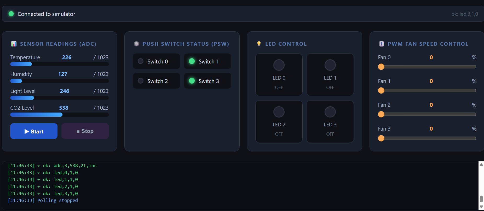

# Smart Room Monitor

## Group Information

|  |  |
| --- | --- |
| Group name | Smart Room Monirtoring |
| Member 1 | [PRARAVEE TREEPATTARACHAYAKORN] — [65070504005] |
| Member 2 | [PALAWAT PHONGSRI] — [67070504009] |
| Member 3 | [CHANNARONG SAOWAKHO] — [67070504023] |
| Course | INC272: Web-Based IoT Applications (2026) |

---

## Project Goal

A single-page browser dashboard that monitors environmental sensor values (temperature, humidity, light, CO2) and push switch states in real time, while letting the user control four LEDs and four PWM fan speed channels through the course mock hardware simulator.

---

## Simulator Features Used

At least 2 features are required — this project uses all four:

-  LED — 4 channels, toggle on/off
-  PSW — 4 push switches, read state
-  ADC — 4 analog channels, read sensor values
-  PWM — 4 channels, control duty ratio

---

## Interface Features

### Monitoring Elements

| Element | What It Shows | Simulator Feature |
| --- | --- | --- |
| ADC bar gauge × 4 | Sensor value (0–1023) for Temperature, Humidity, Light, CO2 | ADC ch.0 – ch.3 |
| PSW indicator dot × 4 | Whether each push switch is pressed or released | PSW ch.0 – ch.3 |
| Connection status bar | Live WebSocket connection state | — |
| Log panel | Timestamped record of every command sent and response received | — |

### Control Elements

| Element | What It Does | Command Sent |
| --- | --- | --- |
| LED toggle button × 4 | Click to toggle each LED on or off | `led,<id>,2` |
| PWM slider × 4 | Drag to set fan duty cycle 0–100% | `pwm,<id>,<value>` |
| Start Polling button | Begin automatic 1-second sensor reads | sends `adc,0–3` and `psw,0–3` |
| Stop button | Pause automatic polling | — (clears interval) |

---

## How to Run

1. Start the mock hardware server:

    ```
    cd C:\Users\Admin\Documents\INC272-2026\simulator\mock-hardware-server 
    npm start
    // this is our file located which we use the coures server. 
    ```

2. Open `index.html` using VS Code Live Server (right-click → Open with Live Server).
3. Check the browser console — a `WebSocket connected` message should appear in the log panel.
4. Check the server terminal — `[CONNECT]` should be printed.
5. Wait for user action before automatically run the data record.(prees start button),(stop button use to shutdown the code while it running)

---


## Known Limitations

- The simulator generates random ADC values; the labels (Temperature, Humidity, etc.) are illustrative.
- PWM slider values are sent on every `input` event, which may generate many messages if the slider is dragged quickly. 
- If the simulator is not running when the page loads, the app retries the connection every 3 seconds automatically.

---

## Screenshots
 




